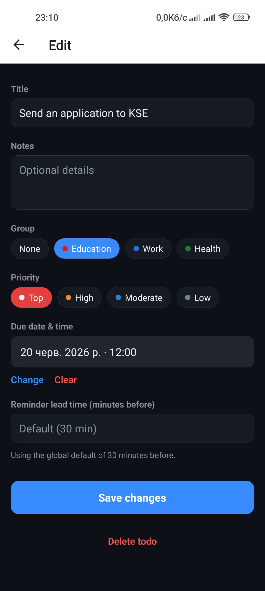
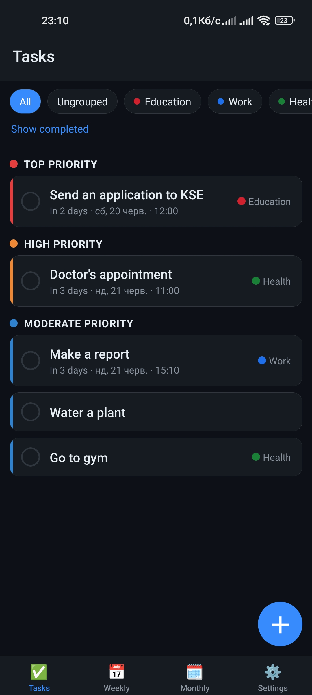
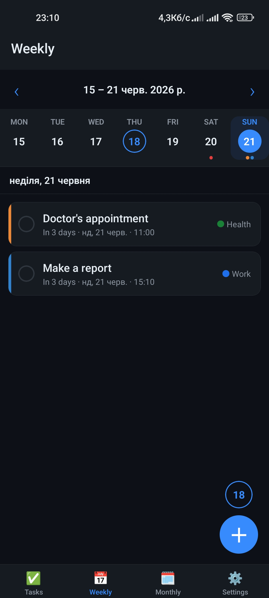
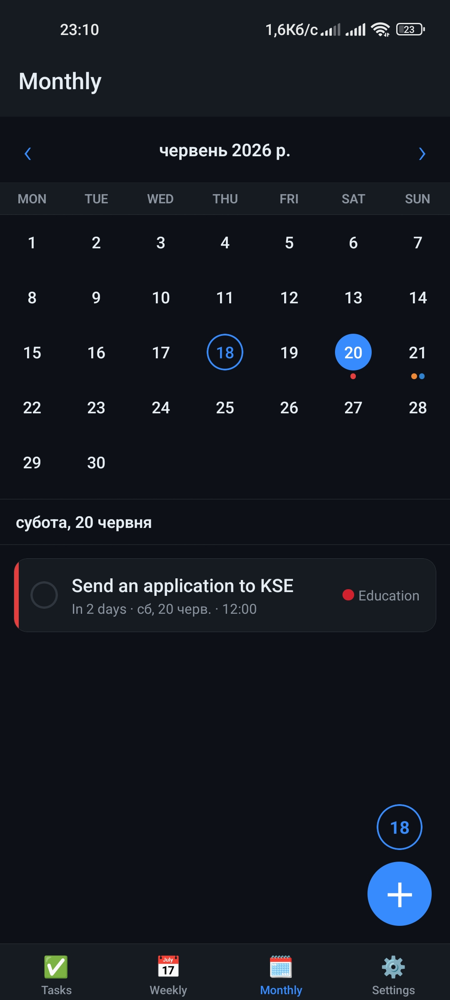

# TODO (local, Android-first)

A personal, single-user TODO app. **No accounts, no backend, no network, no sync** —
everything lives on the device in SQLite. Android is the first target; the code is kept
structured so iOS can be added later (see `PLAN.md` Phase 6).

Built with Expo (managed workflow), expo-router, expo-sqlite + Drizzle ORM, Zustand,
expo-notifications, and react-native-android-widget.

## Screenshots

<table>
  <tr>
    <td></td>
    <td></td>
    <td></td>
    <td></td>
  </tr>
</table>

## Features

- Todos with title, optional notes, optional **due date + time**, and a per-todo
  reminder lead time (with a global default).
- Groups (lists); a todo belongs to zero or one group. Deleting a group ungroups its
  todos (it never deletes them).
- A local notification that fires a configurable amount of time **before** the due time.
- An Android home-screen widget showing upcoming todos, kept in sync with the app.

## Requirements

- Node.js **>= 20.19.4** (newer Expo SDK 56 tooling requires it; 20.16 emits warnings).
- For device builds: an Expo account and the EAS CLI (`npm i -g eas-cli`).
- Android device or emulator (notifications/exact timing and the widget must be tested on
  a **real device** — see "Known gotchas" in `CLAUDE.md`).

## Develop

```bash
npm install
npm run start          # Expo dev server (then press 'a' or scan with a dev build)
npm run android        # build/run on a connected device or emulator
```

Notifications and the widget require native modules, so they only work in a **development
build / installed APK**, not in Expo Go.

## Quality gates

```bash
npm run typecheck      # tsc --noEmit (strict)
npm run lint           # ESLint (flat config) + Prettier
npm run test           # Jest unit tests (date logic, fire-time math, repositories)
```

All three pass on a clean checkout. The repository tests run against an in-memory
`better-sqlite3` DB using the same Drizzle schema/migration the app ships.

## Database / migrations

Schema lives in `src/db/schema.ts`. After editing it, regenerate the migration:

```bash
npm run db:generate    # drizzle-kit generate -> src/db/migrations/*
```

Migrations run automatically on app startup (`src/db/client.ts`). All DB access goes
through `src/db/repositories/*` — no raw SQL elsewhere.

## Build an installable APK

```bash
eas login
eas init               # first time only, links the project to your Expo account
eas build -p android --profile preview
```

The `preview` profile (`eas.json`) sets `android.buildType = "apk"` and produces an
installable APK. Install it on a clean device and smoke-test:

1. Create a group and a todo with a due date/time a few minutes out.
2. Confirm the reminder fires at `dueAt - leadMinutes`.
3. Complete/delete the todo and confirm the reminder is cancelled.
4. Add the home-screen widget and confirm it lists upcoming todos and that tapping an
   item opens it (deep link), and "+ Add" opens the create screen.

## Project structure

```
app/                  expo-router screens
  _layout.tsx         bootstrap (DB, notifications, reconcile), nav, deep-link handling
  index.tsx           main screen: group filter + todo list
  todo/[id].tsx       create / edit a todo ('new' = create)
  groups.tsx          group management (create/rename/recolor/delete)
  settings.tsx        global default reminder lead time
src/
  db/                 schema, client (+migrations), repositories, test helpers
  notifications/      channel + permissions, fire-time math, scheduler, reconcile
  widget/             snapshot, TodoWidget UI, task handler, update trigger
  services/           bootstrap + data-change side-effect orchestration (sync.ts)
  store/              Zustand: uiStore (ephemeral), dataStore (cached views + actions)
  lib/                date/time helpers, theme
  components/         shared UI (TodoListItem, DateTimeField)
index.ts              entry: expo-router + Android widget task handler registration
app.config.ts         Expo config + plugins
```

## Notes / constraints

- TypeScript strict mode; `any` is avoided (one justified use in `src/db/types.ts`).
- Local-only by design: do not add auth, a backend, analytics, or sync.
- iOS is a future phase and intentionally not yet enabled.
